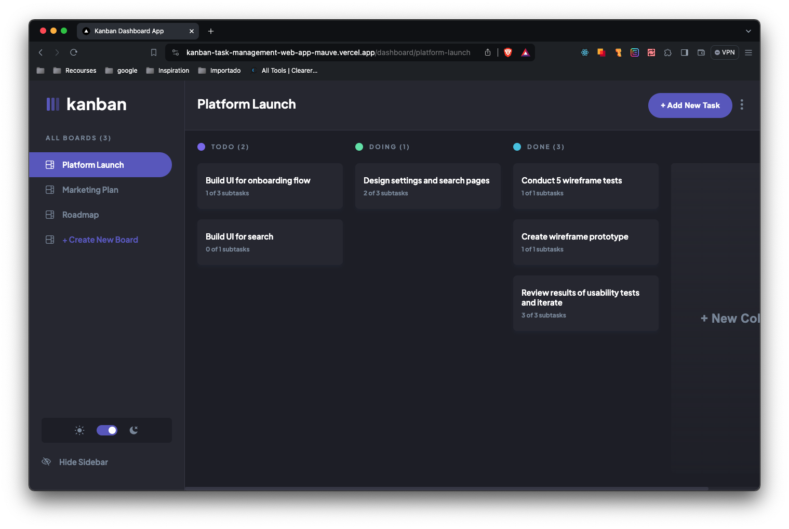

# Frontend Mentor - Kanban task management web app solution

This is a solution to the [Kanban task management web app challenge on Frontend Mentor](https://www.frontendmentor.io/challenges/kanban-task-management-web-app-wgQLt-HlbB). Frontend Mentor challenges help you improve your coding skills by building realistic projects. 

## Table of contents

- [Overview](#overview)
  - [The challenge](#the-challenge)
  - [Screenshot](#screenshot)
  - [Links](#links)
- [My process](#my-process)
  - [Built with](#built-with)
  - [What I learned](#what-i-learned)
  - [Continued development](#continued-development)
- [Author](#author)

## Overview

### The challenge

Users should be able to:

- View the optimal layout for the app depending on their device's screen size &#9989;
- See hover states for all interactive elements on the page &#9989;
- Create, read, update, and delete boards and tasks &#9989;
- Receive form validations when trying to create/edit boards and tasks &#9989;
- Mark subtasks as complete and move tasks between columns &#9989;
- Hide/show the board sidebar &#9989;
- Toggle the theme between light/dark modes &#9989;
- **Bonus**: Allow users to drag and drop tasks to change their status and re-order them in a column
- **Bonus**: Keep track of any changes, even after refreshing the browser (`localStorage` could be used for this if you're not building out a full-stack app) &#9989;
- **Bonus**: Build this project as a full-stack application &#9989;

### Screenshot

- Login Demo Page

- Dashboard

### Links

- Solution URL: [Add solution URL here](https://your-solution-url.com)
- Live Site URL: [kanban-task-management-web-app-mauve.vercel.app](https://kanban-task-management-web-app-mauve.vercel.app/)

## My process

### Built with

- [React](https://reactjs.org/) - JS library
- [Next.js](https://nextjs.org/) - React framework
- [Formik](https://formik.org/) - React framework
- Typescript
- SQL
- CSS / SASS custom properties
- Flexbox

### What I learned

This project was quite a challenge. It is a Full-Stack application coded with React and TypeScript using the Next.js Framework and Formik. Also using SQL and PostgreSQL. 

### Continued development

In the future I may develop the registration and login process. 

## Author

- Website - [Mauro Dollinger](https://www.maurodollinger.com.ar)
- Frontend Mentor - [@maurodollinger](https://www.frontendmentor.io/profile/maurodollinger)
- Twitter - [@dollingermauro](https://www.twitter.com/dollingermauro)

